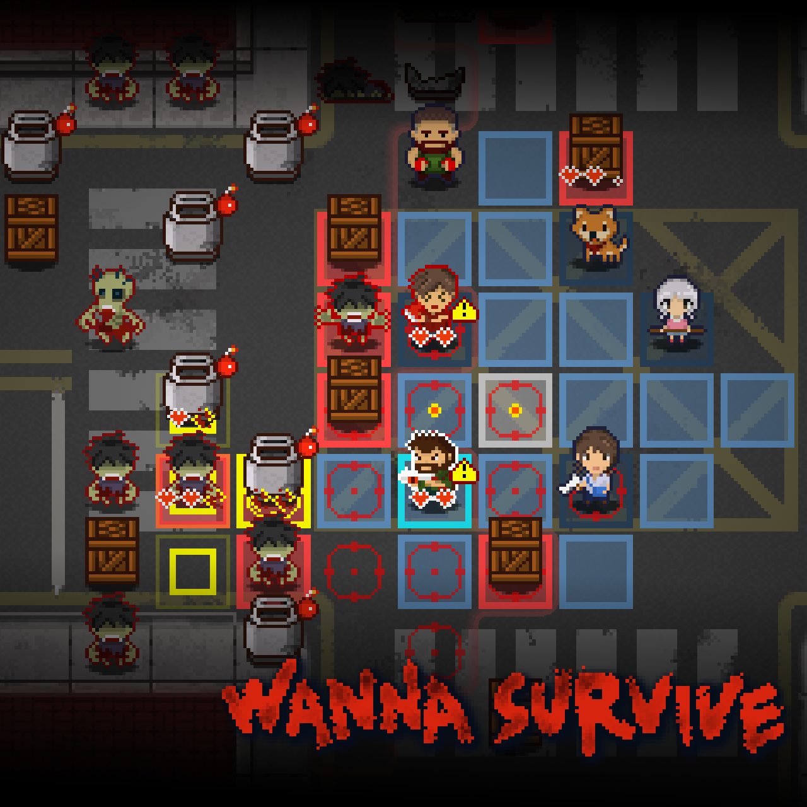
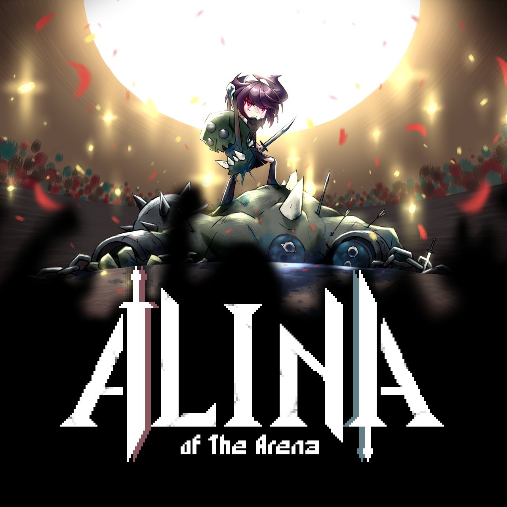

<!--連結管理-->
[PINIXWebLink]: http://www.pinixgames.com
<!--連結管理-->

<a href="../zh-TW/" class="button small" target=_self>繁體中文</a>

---
# FACTSHEET
+ **Developer**  
PINIX games studio  
Based in Taipei, Taiwan

+ **Founding date**  
May, 2018

+ **Website**  
[pinixgames.com][PINIXWebLink]

+ **Press / Business contact**  
maxwei@pinixgames.com

+ **Social**  
twitter: ** www.twitter.com/pinixgames **  
facebook: ** www.facebook.com/pinixgames **
patreon: ** www.patreon.com/pinix **

+ **Phone**
+886 987 066 554

---

# DESCRIPTION
PINIX Games was founded in 2018 and likes to create games that require 'thinking'.
We hope to create enjoyable experiences that we can be proud of and that someone in the world will like it too.

---

# PROJECTS  
+ ## 

<table><td>

</td></table>

+ ## 
<table><td>

</td></table>

---

# Team
Max Chen
maxwei@pinixgames.com

---