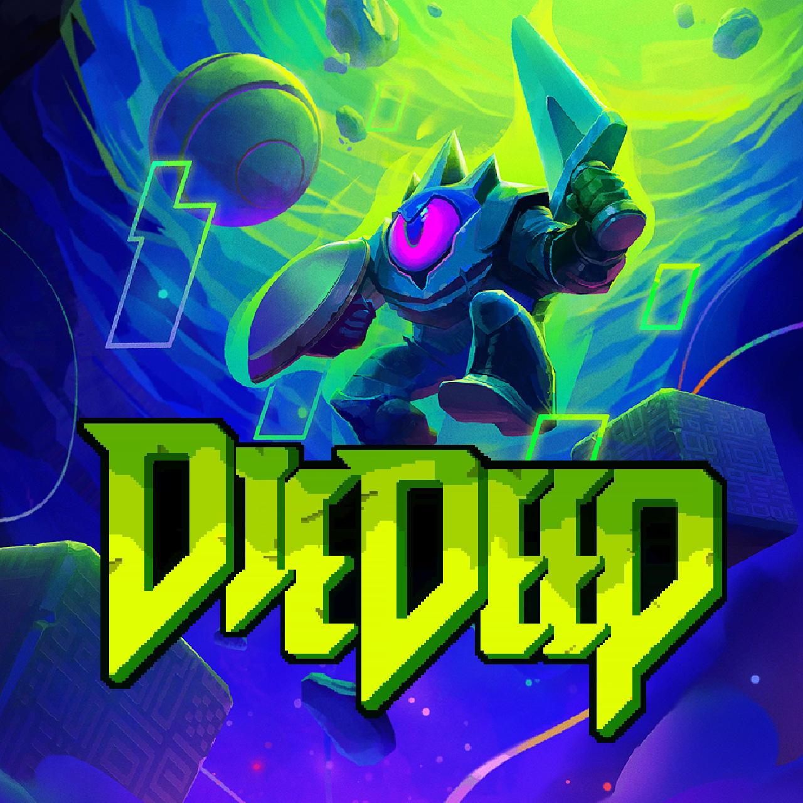

<!--連結管理-->
[PINIXWebLink]: http://www.pinixgames.com
<!--連結管理-->

<a href="../en/" class="button small" target=_self>English</a>

---
# 簡介
+ **開發者**  
PINIX games studio  
位於 台北, 台灣  

+ **創立時間**  
2018年5月

+ **網站**  
[pinixgames.com][PINIXWebLink]

+ **媒體／商業聯繫**  
maxwei@pinixgames.com

+ **社群**  
twitter: ** www.twitter.com/pinixgames **  
facebook: ** www.facebook.com/pinixgames **
patreon: ** www.patreon.com/pinix **

+ **電話**
+886 987 066 554

---

# 概述
PINIX，成立於2018年5年。
專注於創作有挑戰性、不愧對自己靈魂也讓玩家能感受樂趣的遊戲。 

---

# 遊戲  
+ ##  死深 - In developing
**聚焦於純粹敵我對峙戰鬥的動作遊戲**
<table><td>

</td></table>

+ ##  鬥技場的阿利娜 - Released on 2022
**一款結合 Slay The Spire 殺戮尖塔 和 Into the Breach 的戰棋Roguelike牌組構築遊戲**
	+ 台北電玩展 **Indie Game Award 2023 最佳遊戲設計**
	+ BitSummit 2023 EXCELLENCE IN GAME DESIGN AWARD 入圍
<table><td>

</td></table>  

+ ##  活屍戰棋 - Released on 2019
**大量活屍同時來襲，敵方回合只需數秒之間！一款強調走位佈局深度策略的快節奏回合制戰棋遊戲。**
	+ ファミ通 2021 入選 **白銀殿堂** 
<table><td>

</td></table>

---

# 成員
陳亦威 Max Chen
maxwei@pinixgames.com