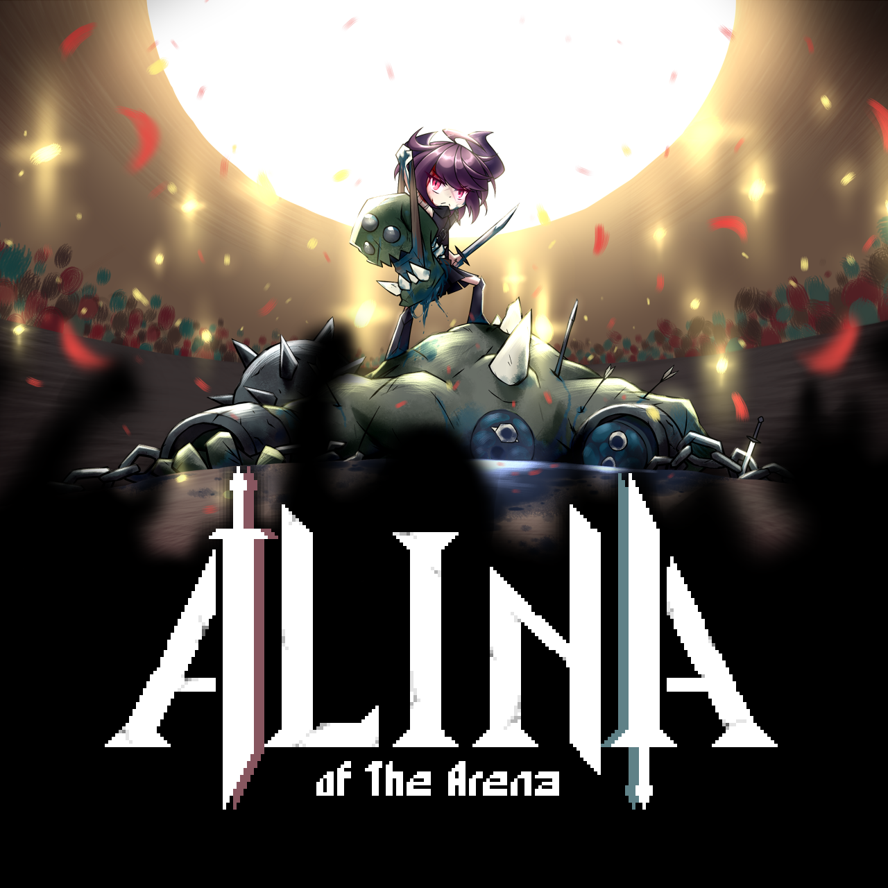

<!--連結管理-->
[PINIXWebLink]: http://www.pinixgames.com
<!--連結管理-->
<a href="../en/" class="button small" target=_self>English</a>
# 簡介
+ **開發者**  
PINIX games studio  
位於 台北, 台灣  

+ **創立時間**  
2018年5月

+ **網站**  
[pinixgames.com][PINIXWebLink]

+ **媒體／商業聯繫**  
maxwei@pinixgames.com

+ **社群**  
twitter: ** www.twitter.com/pinixgames **  
facebook: ** www.facebook.com/pinixgames **
patreon: ** www.patreon.com/pinix **

+ **電話**
+886 987 066 554

---

# 概述
PINIX，成立於2018年5年，喜歡也擅長於創作需要「思考」的遊戲，只希望能做出不愧對自己的遊戲，並讓其他人也能感受到它的樂趣  

---

# 遊戲  
+ ## 

> PINIX 的第一個作品，
> 大量活屍同時來襲，敵方回合只需數秒之間！」  
> 一款強調走位佈局深度策略的快節奏回合制戰棋遊戲。

+ ## 

> 一款結合 Slay The Spire 殺戮尖塔 和 Into the Breach 的戰棋Roguelike牌組構築遊戲，

---

# 成員
陳亦威 Max Chen
maxwei@pinixgames.com